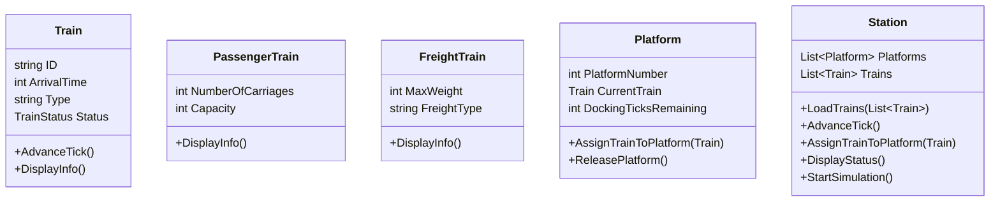

# oop_pw1_ext_2425
# Cover

**Student ID**: 9403538

# Table of Contents

1. [Introduction](#introduction)
2. [Description](#description)

   * [Architecture Overview](#architecture-overview)
   * [Class Diagram](#class-diagram)
   * [Key Methods and Flows](#key-methods-and-flows)
3. [Problems Encountered](#problems-encountered)
4. [Conclusions](#conclusions)

---

## Introduction

**Group Members:**

* Nicolás Guzmán Bastida

**Summary:**
This document details the design and implementation of a train station simulation in C#. It covers the object-oriented design, key decisions, challenges faced, and insights gained.

---

## Description

### Program structure

The system is structured around the following main components:

* **Train (abstract)**: Base class for all trains, with common attributes and methods.
* **PassengerTrain** and **FreightTrain**: Subclasses of Train, adding specific properties. Implements inheritance.
* **Platform**: Represents a station platform, manages docking ticks and the current train.
* **Station**: Manages collections of Train and Platform objects, drives the simulation loop, assignment, and state display.
* **Program**: Console that interacts with the user, loads CSV data, and triggers the simulation.

### Class Diagram

### Key Methods 

* **LoadTrains**: Reads CSV, instantiates appropriate Train subclasses, and populates Station.Trains.
* **AdvanceTick**:

  1. Decrement ArrivalTime for OnRoute trains.
  2. Assign arriving trains (ArrivalTime == 0) to free platforms or mark as Waiting.
  3. Decrement DockingTicksRemaining on occupied platforms, moving trains to Docked when ticks reach 0.
* **StartSimulation**: Main loop that calls AdvanceTick, checks for completion, and displays state until all trains are Docked.

---

## Problems Encountered

* **Race Conditions**:  It was tricky to ensure that once a train finished its docking ticks, the platform became available in the very next simulation step without causing overlap or leaving stale references.
* **CSV file Paths**: Ensuring that the CSV file is correctly located, copied to the output directory, and loaded at runtime required trying a lot of paths so that data/Trains.csv was included.
* **State Management**:Coordinating the four train status (OnRoute -> Waiting -> Docking -> Docked) and ensuring each transition happened at the right moment (arrival, assignment to platform, completion of docking) supossed carefully ordering the simulation steps and thoroughly testing edge cases.

---

## Conclusions

* I learned how to design classes and relationships using abstraction, encapsulation, inheritance and polymorphism in a real project.

* I saw why it is key to have clear state transitions and handle possible errors when reading files and addressing them.

* I discovered how to handle a console interface for the user step by step, controlling the simulation by pressing a key.

